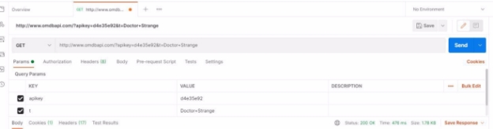



Programación Web Full Stack

 **Consumo de APIs desde el back-end**

**Práctica integradora**

**Objetivo**

En la anterior ejercitación vimos cómo crear una API, ahora veamos cómo podemos consumir una API externa. Recordemos que no todas las APIse pueden usar libremente,es decir,existen algunas que son privadas, otras son públicas o podemos encontrar que tengan solo algunos endpoints privados y otros públicos.

Además, en esta ejercitación practicaremos cómo podemos usar la herramienta [Postman para ](https://www.postman.com/downloads/)ayudarnos en la conexión con las APIs.

¡Buena suerte! 😎👍✨

**Micro desafío - Paso 1:**

Retomemos nuestro proyecto de la práctica anterior. En caso de que no lo tengamos, podemos usar de base el siguiente **[proyecto creado con Express** (recordemos](https://drive.google.com/file/d/1mR_hF06nGoL6LV1utkvw82T3jaXjhwNk/view?usp=sharing)** instalar todas las dependencias del proyecto, ejecutando el comando **npm install** 😉).

Nuestra tarea será la de crear la lógica necesaria que permita traer los datos de una película, cuando esta no esté en la lista de películas.

Para traer los datos de la película que deseamos consultar, usaremos una API externa: [omdbapi.com (esta](http://www.omdbapi.com/) es una API pública que nos ofrece información de películas y series). Nuestro desafío consiste en consumir esa API para devolver los datos de la película a nuestro front-end.

Por ejemplo, si buscamos la película **Doctor Strange** y esta no se encuentra en la lista de películas que hemos cargado desde nuestra base de datos movies\_db, debemos desarrollar la funcionalidad que le permita al usuario buscar la película en la API: <http://www.omdbapi.com/?apikey=d4e35e92&t=Doctor+Strange> para que nos retorne los datos correspondientes.

Para poder utilizarla solo debemos registrarnos ingresando a omdbap[i apikey. Ahí ](http://www.omdbapi.com/apikey.aspx)obtendremos una key que nos permitirá realizar hasta mil consultas por día de manera gratis con solo ingresar nuestros datos. Luego, recibiremos un e-mail con un link para verificar y activar la key asignada. Por ejemplo: si nos asignan la key: **d4e35e92**, podremos realizar las consultas en Postman de esta manera: <http://www.omdbapi.com/?apikey=d4e35e92&t=Doctor+Strange>

Recordemos que Postman nos ayuda a entender mejor los datos que nos retorna la API y verificar que nos estamos conectando correctamente a una API en particular.

**Micro desafío - Paso 2:**

Muchas veces, como programadores, nos toca desarrollar el back-end totalmente desconectados del front-end. En esos casos, las herramientas como **Postman** se vuelven nuestros mejores amigos, ya que nos permiten verificar que nuestra lógica de programación es la correcta, cuando no podemos hacerlo usando el front-end.

Teniendo en cuenta esto, nuestro desafío es poder utilizar **Postman** para: **crear**, **modificar** y **eliminar** registros en nuestra base de datos **[movies_db**, usando](https://drive.google.com/file/d/1RMdSWO2GjEVixkuuOb0MQ0AaqVulW64q/view?usp=sharing)** los endpoints que codificamos en la práctica de la clase anterior.

**Conclusión**

Como programadores es importante entender que podemos consumir APIs externas tanto desde del back-end como del lado del front-end, y también podemos crear nuestras propias APIs para proveer un punto de acceso a nuestro front-end o poder ofrecer a otras aplicaciones externas nuestras funcionalidades.

Por eso, es recomendable manejar una herramienta como Postman que nos ayude a entender y manipular las APIs que tengamos que desarrollar, consultar, etc.

**¡Hasta la próxima!**

